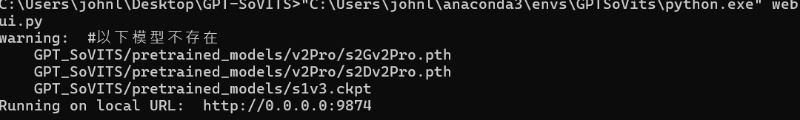

# GPT-SoVITS 語音克隆實作紀錄

## 📌 專案背景 (Project Overview)
本專案為 AI 語音合成的實作練習，旨在掌握從語音數據清洗、音頻切片到模型微調（Fine-tuning）的完整 Pipeline。

## ⚙️ 開發環境 (Environment)
針對本地硬體進行了環境優化與效能測試：
- **GPU**: NVIDIA GeForce RTX 4060 Ti (16GB VRAM)
- **Storage**: C 槽 SSD (優化 I/O 讀取效率，避免訓練時的 Bottleneck)
- **Framework**: PyTorch / CUDA 12.x

## 🛠️ 我的實作內容 (My Contribution)
- **數據集準備**：採集並處理了約 [填入時間，例如：30 分鐘] 的原始語音資料。
- **資料清洗**：使用 UVR5 進行人聲分離，並透過內建腳本完成去噪與 10s 以內的音頻自動切片。
- **模型訓練**：在本地端完成訓練，並針對 [某個音色] 進行了參數調優。

## 📊 遇到的問題與解決方案 (Technical Challenges)
- **問題 A**：初始環境路徑報錯或 Cuda 版本衝突
- **解決方案**：透過 Conda 重新建置獨立環境，並手動指定 Path 位址
- **B. Git 指令環境變數失效 (Command Not Found)**
- **問題描述**：在執行 `git init` 初始化專案版本控制時，系統噴出 `'git' 不是內部或外部命令` 錯誤，導致無法與 GitHub 連動。
- **技術分析**：此為典型的 **Environment Variables (PATH)** 映射失效。作業系統在執行 Shell 指令時，無法在目前的搜尋路徑中找到 Git 的二進位執行檔。
- **解決方案**：重新安裝 Git 核心套件並手動確認 Path 映射路徑，隨後**重啟終端機執行環境**（重新載入 Context），成功恢復指令調用功能。

### **C. 訓練過程中的 I/O 瓶頸優化 (Hardware Performance)**
- **問題描述**：GPT-SoVITS 在訓練期間需要頻繁隨機讀取數千個小體積音訊切片（Audio Slices），產生極大量的碎檔 I/O 請求。
- **技術分析**：若將專案放在機械硬碟 (HDD)，磁頭的物理尋道時間會造成嚴重的 **IO Wait**，導致 RTX 4060 Ti 顯卡運算效能被硬碟速度拖累，形成系統瓶頸。
- **解決方案**：將整個專案環境與當前訓練數據集部署於 **NVMe SSD (C 槽)**，利用固態硬碟高隨機讀取（Random 4K Read）的特性，確保數據吞吐量能精確餵飽 GPU 算力。****

## 🎧 實作成果
## 🎧 實作成果 (Results)

### ⌨️ 環境部署證明

*(註：終端機截圖證明專案於 `GPTSoVits` 虛擬環境啟動，成功調用 Conda 的 `python.exe` 執行 `webui.py`。)*

### 🖥️ 推理介面截圖

*(註：此圖展示了 GPT-SoVITS 推理頁面，證明已具備操作此 AI 工具進行語音合成的能力。)*
