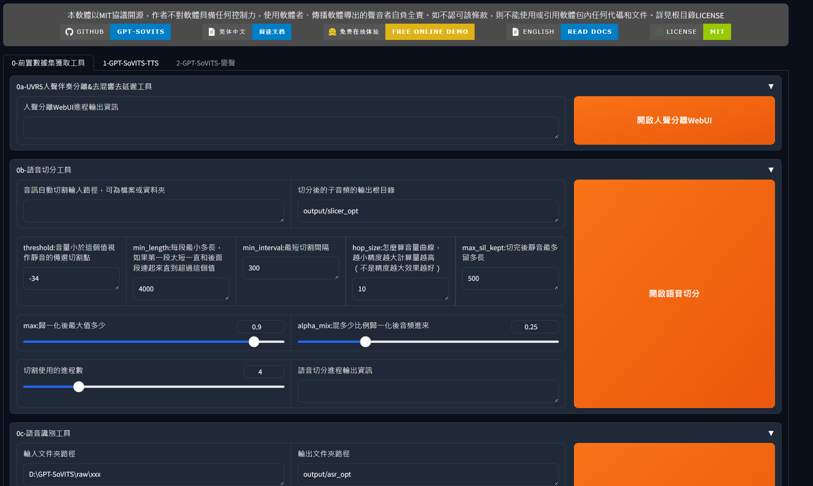
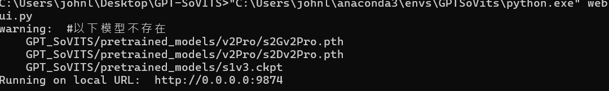

# GPT-SoVITS v2Pro 個人語音微調實作

本專案使用 [GPT-SoVITS](https://github.com/RVC-Boss/GPT-SoVITS) 的 v2Pro 模型，實作從中文語音資料處理、文字標註、特徵提取，到 GPT 與 SoVITS 模型微調的完整流程。

> 本專案重點是驗證本地端語音微調流程，不代表已達到商業級語音克隆品質。

## 專案流程

1. 錄製中文語音
2. 依停頓將音訊切成短片段
3. 使用語音辨識產生初步文字標註
4. 建立文字、音素與語意特徵
5. 分別微調 GPT 與 SoVITS 模型
6. 使用參考音訊與輸入文字進行語音合成

## 實驗資料

本專案共進行兩次個人語音微調實驗：

| 實驗 | 有效片段 | 總長度 | 說明 |
| --- | ---: | ---: | --- |
| JJY_00 | 8 段 | 約 43.7 秒 | 第一版，小型流程驗證 |
| JJY_01 | 20 段 | 約 129 秒 | 第二版，增加語音與句型數量 |

兩組資料量都偏少，因此主要用於確認訓練與推論流程能正常完成，不足以證明模型在不同語氣、長句與複雜文本下皆能穩定還原音色。

## 訓練設定

### GPT 模型

| 實驗 | 設定 epochs | Batch size | 精度 | 輸出權重 |
| --- | ---: | ---: | --- | --- |
| JJY_00 | 15 | 8 | 16-bit mixed precision | Epoch 5、10、15 |
| JJY_01 | 16 | 8 | 16-bit mixed precision | Epoch 5、10、15 |

共同設定：

- 預訓練模型：`s1v2.ckpt`
- Optimizer learning rate：`0.01`
- Warmup steps：`2000`
- Random seed：`1234`

### SoVITS 模型

| 實驗 | 訓練 epochs | Batch size | Learning rate | 輸出權重 |
| --- | ---: | ---: | ---: | --- |
| JJY_00 | 18 | 8 | 0.0001 | Epoch 4、8、12、16 |
| JJY_01 | 12 | 8 | 0.0001 | Epoch 4、8、12 |

共同設定：

- 模型版本：v2Pro
- 訓練取樣率：32 kHz
- FP16：啟用
- Random seed：`1234`
- 預訓練模型：`s2Gv2Pro.pth`、`s2Dv2Pro.pth`

## 實作成果

本專案已完成：

- 中文語音切片與文字標註
- GPT 與 SoVITS 模型微調
- 多個 epoch checkpoint 輸出
- 本地 WebUI 推論
- 語音合成 Demo

### 語音 Demo

[下載或試聽合成結果](./show/output_demo.wav)

Demo 格式：

- 單聲道 WAV
- 32 kHz
- 約 1 分 50 秒

### WebUI

### 執行畫面

## 執行環境

- GPU：NVIDIA GeForce RTX 4060 Ti 16GB
- Python：3.9.25
- PyTorch：2.7.1+cu118
- Gradio：4.44.1
- 作業系統：Windows

## 專案限制

- 訓練資料只有約 44 秒與 129 秒，音色與語氣覆蓋有限。
- 尚未使用 MOS、說話者相似度或固定測試文本進行客觀評估。
- 尚未系統化比較所有 checkpoint，因此不宣稱某一組權重是最佳模型。
- 模型權重與原始錄音涉及容量及個人聲音隱私，未包含於此 GitHub 儲存庫。
- 本專案目前為本地端實驗，沒有提供公開的線上推論服務。
- 專案包含上游 GPT-SoVITS 原始碼；個人工作主要集中於環境建置、資料處理、模型微調、測試與成果整理。

## 致謝與授權

本專案基於 [RVC-Boss/GPT-SoVITS](https://github.com/RVC-Boss/GPT-SoVITS) 實作，原始程式碼版權與授權條款依上游專案規定。
